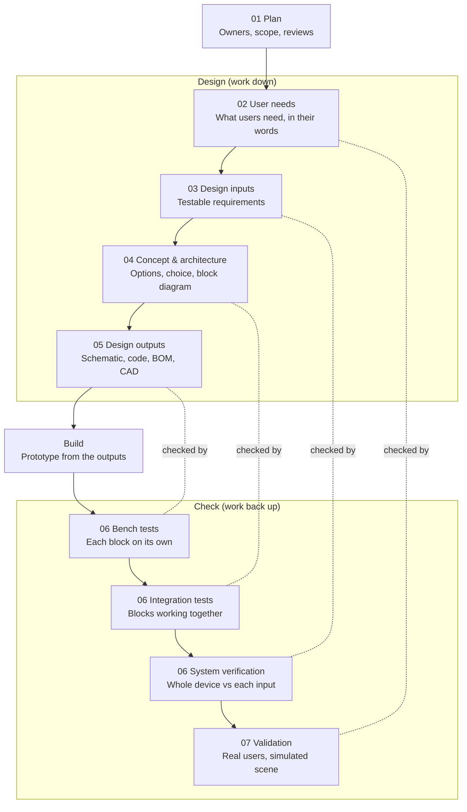

# Design control starter kit

Simple, fill-in templates for every stage of medical device design control, written for our portable cardiac triage device. No prior regulatory knowledge needed.

These files are the team's copy. Change them through a pull request, like any other doc.

## How the stages connect

Work flows down the left side, gets built, then climbs back up the right. Each box on the right checks the box opposite it, and a design review closes every stage.

**Runs through every stage:** [09 Risk (DFMEA)](09-risk-dfmea.md) · [10 Usability](10-usability.md) · [11 Traceability matrix](11-traceability-matrix.md) · [08 Design review](08-design-review.md) closes each stage.

If a check on the right fails, go back to the box opposite it, fix it, and write down why.

## The templates

One file per stage, numbered in the order you use them. 01 to 08 follow the flow above. 09 to 11 run alongside every stage, so start them on day one and keep adding rows.

| File | Stage | One-line purpose |
| --- | --- | --- |
| [01](01-plan.md) | Plan | Who does what, what's in scope, when we review |
| [02](02-user-needs.md) | User needs | What users need, in their own words |
| [03](03-design-inputs.md) | Design inputs | Measurable "shall" requirements, each with a test |
| [04](04-concept-and-architecture.md) | Concept & architecture | Options, a fair choice, and the block diagram |
| [05](05-design-outputs.md) | Design outputs | The files that fully describe the design |
| [06](06-verification.md) | Verification | Tests proving each input is met |
| [07](07-validation.md) | Validation | Real users proving the device meets their needs |
| [08](08-design-review.md) | Design review | The go / fix-first meeting at the end of each stage |
| [09](09-risk-dfmea.md) | Risk (DFMEA) | How parts fail and how we stop that from hurting anyone |
| [10](10-usability.md) | Usability | Making sure a stressed, untrained person gets it right |
| [11](11-traceability-matrix.md) | Traceability matrix | One table linking every need to its proof |

## How to use these templates

Every template has the same five parts, so you always know where to look:

1. **What it's for**: one or two lines.
2. **Questions it answers**: if you can answer these, the stage is done.
3. **Template**: a table to fill in.
4. **Example**: one or two rows filled in for our triage device, so you can see the level of detail.
5. **Free resources**: links worth 20 minutes of reading.

Five rules keep it simple:

- **Give every row an ID** (UN-01, DI-01, VER-01). IDs are how one stage links to the next.
- **One idea per row.** If a row has "and" in it, split it.
- **Never guess a number from a standard.** Write [check standard] until someone has read it.
- **Example rows are illustrations, not team decisions.** Replace them with ours.
- **Going back is normal.** If a test fails, change the earlier stage and write one line on what changed and why.

## Key words in plain English

Ten words cover almost everything. The two people mix up most are verification and validation.

| Word | Plain meaning | Example from our device |
| --- | --- | --- |
| User need | What the user needs, in their words | "I can tell which patient to see first" |
| Design input | A measurable requirement the design must meet | "Shows High/Medium/Low within 90 s of the last sensor going on" |
| Design output | The files that describe the design | Schematic, PCB, firmware, BOM, CAD |
| Verification | Did we build it right? Test each output against its input | Bench test: our SpO2 vs a reference oximeter |
| Validation | Did we build the right thing? Real users in a real or simulated setting | A volunteer triages three patients using only the quick-start sheet |
| Traceability | Every need links to its inputs, outputs and tests by ID | UN-01 → DI-03 → schematic sheet 2 → VER-05 |
| Hazard | Something that could cause harm | Cuff pressure that never releases |
| Risk | How likely the harm is, combined with how bad it is | Low chance, but serious, so it must be controlled |
| DFMEA | A table of how each part can fail, what happens, and how we prevent it | Pressure sensor tube pops off → pump keeps running → timer cuts power |
| Design review | A short meeting at the end of a stage that decides: go, or fix first | Review the schematic before ordering the PCB |

The 90 s target is an example, not a decision.

## Who owns which template

Every template has one owner who keeps it up to date; everyone else contributes rows. These are suggestions based on the team roles.

| Template | Owner | Contributes |
| --- | --- | --- |
| [01 Plan](01-plan.md) | Discipline leads together | Scientific writer keeps the file |
| [02 User needs](02-user-needs.md) | Clinical & regulatory advisor | Whole team; scientific writer drafts |
| [03 Design inputs](03-design-inputs.md) | Each lead, for their own block | Clinical & regulatory adds the standards rows |
| [04 Concept & architecture](04-concept-and-architecture.md) | Electrical lead | Mechanical and software leads |
| [05 Design outputs](05-design-outputs.md) | Whoever designs each block | Board architect, firmware, signal processing, comms, mechanical |
| [06 Verification](06-verification.md) | Whoever designed the block runs the test | Someone else checks the result |
| [07 Validation](07-validation.md) | Clinical & regulatory advisor | Scientific writer; volunteers from outside the team |
| [08 Design review](08-design-review.md) | Lead of the discipline under review chairs | At least one person who didn't do the work |
| [09 Risk (DFMEA)](09-risk-dfmea.md) | Clinical & regulatory advisor | Every block owner adds their failure modes |
| [10 Usability](10-usability.md) | Clinical & regulatory advisor | Scientific writer owns the quick-start sheet |
| [11 Traceability matrix](11-traceability-matrix.md) | Scientific writer | Every owner adds their IDs |

## Best free resources to start with

Start with these five; each template lists more.

| Resource | Why read it | Best part for us |
| --- | --- | --- |
| [FDA Design Control Guidance](https://www.fda.gov/regulatory-information/search-fda-guidance-documents/design-control-guidance-medical-device-manufacturers) | The original plain-English explanation of every stage in this kit. A [readable web version](https://innolitics.com/articles/fda-guidance-design-control-guidance/) exists too. | Design input, verification and design review sections |
| [NASA: How to Write a Good Requirement](https://www.nasa.gov/seh/appendix-c-how-to-write-a-good-requirement) | A checklist for turning vague wishes into testable "shall" statements | Use it on every design input |
| [OpenRegulatory templates](https://openregulatory.com/templates/) | Free, minimal templates for ISO 13485, ISO 14971, IEC 62304 and IEC 62366, written to help startups pass audits. Also on [GitHub](https://github.com/openregulatory/templates). | User needs list, FMEA risk table, usability plan |
| [FDA Human Factors guidance](https://www.fda.gov/regulatory-information/search-fda-guidance-documents/applying-human-factors-and-usability-engineering-medical-devices) | How to show that real users can use a device safely | The simulated-use validation testing section |
| [ASQ: What is FMEA?](https://asq.org/quality-resources/fmea) | Step-by-step FMEA with a free spreadsheet template | The step list and the template |

The standards themselves (ISO 14971, IEC 60601 and the rest) cost money. ISO's own page for [ISO 14971](https://www.iso.org/contents/data/standard/07/27/72704.html) links a free preview of the scope and definitions.
